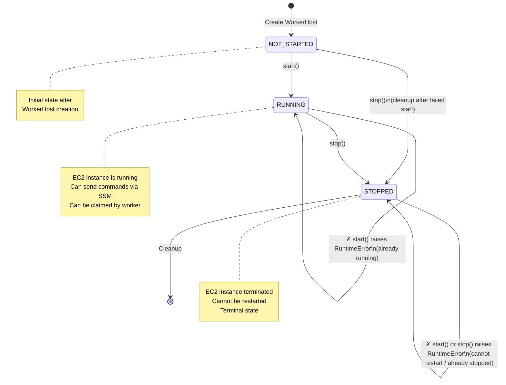
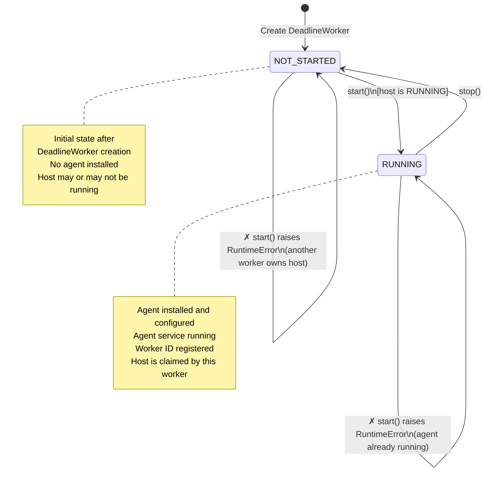
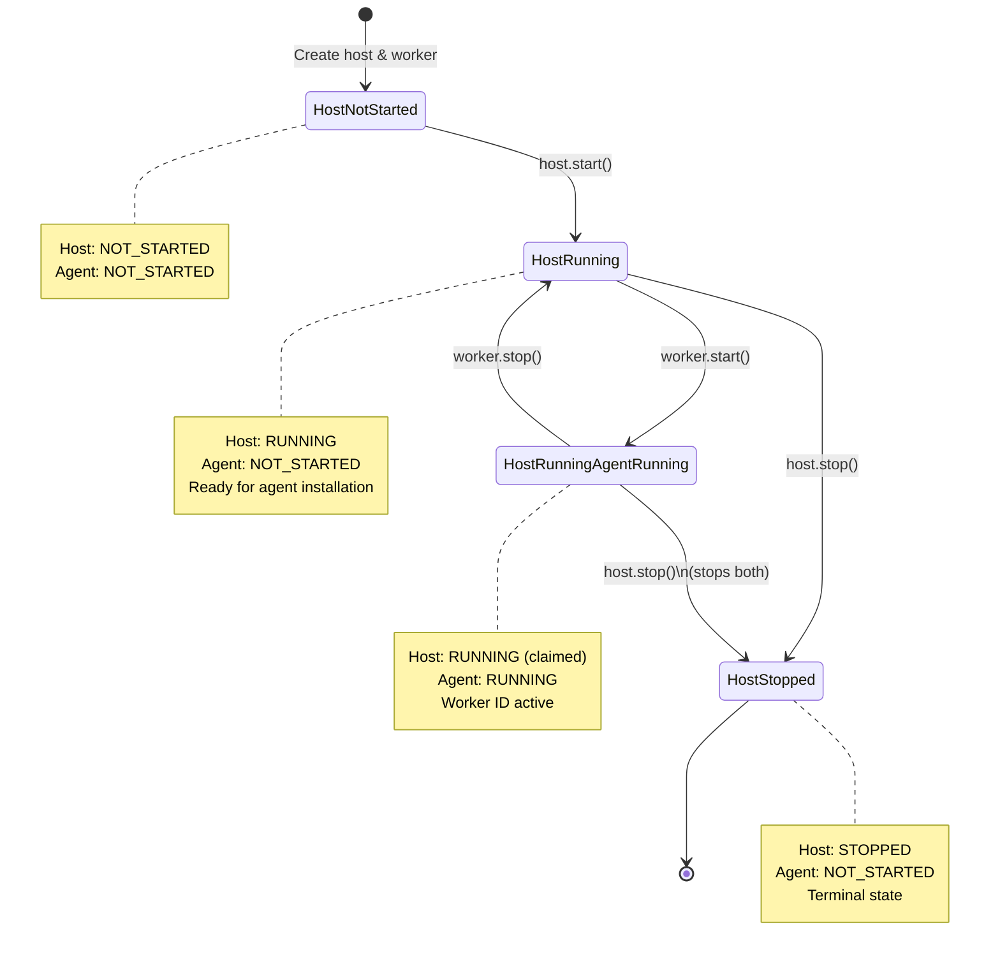
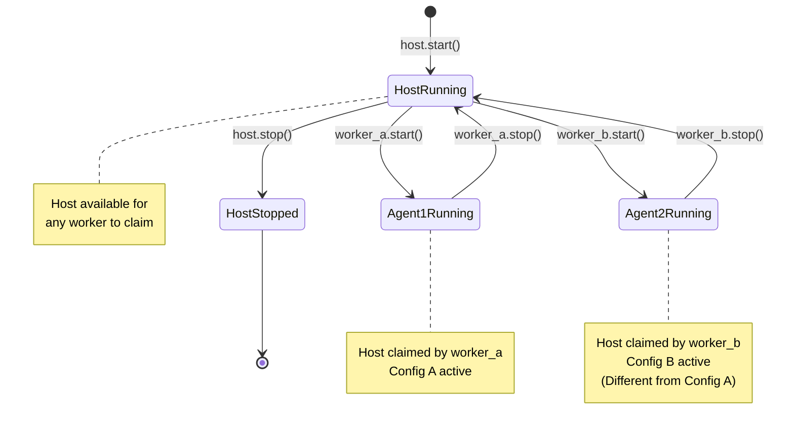

# Design Document

## Overview

This design document describes the refactoring of the `deadline-cloud-test-fixtures` library to decouple EC2 worker host management from worker agent lifecycle management. The current architecture tightly couples these concerns within the `DeadlineWorker` class hierarchy, making it impossible to reuse an EC2 worker host with different worker agent configurations.

The refactored architecture introduces a `WorkerHost` abstraction that handles EC2 host provisioning and lifecycle operations (start, stop, send commands), while the existing `EC2InstanceWorker` classes will be refactored to focus on worker agent installation, configuration, and lifecycle management. The `EC2InstanceWorker` classes will delegate host operations to a composed `WorkerHost` instance.

This design enables new use cases where EC2 worker hosts can be reused with different worker agent configurations, enforcing clear separation of concerns between host and agent management.

**Scope**: This refactoring applies only to EC2-based workers (`EC2InstanceWorker`, `WindowsInstanceWorkerBase`, `PosixInstanceWorkerBase`). Docker-based workers (`DockerContainerWorker`) are excluded from this refactor as containers are inexpensive to launch and do not benefit from host reuse.

## Architecture

### Current Architecture

The current architecture uses inheritance to implement different worker types:

```
DeadlineWorker (ABC)
├── EC2InstanceWorker (ABC)
│   ├── WindowsInstanceWorkerBase (ABC)
│   │   └── WindowsInstanceBuildWorker
│   └── PosixInstanceWorkerBase (ABC)
│       └── PosixInstanceBuildWorker
└── DockerContainerWorker
```

Each class manages both:
1. Host provisioning and lifecycle (EC2 instance or Docker container)
2. Worker agent installation, configuration, and lifecycle

This tight coupling prevents reusing a host with different worker agent configurations.

**Note**: `EC2InstanceWorker`, `WindowsInstanceWorkerBase`, and `PosixInstanceWorkerBase` are abstract base classes as they:

1.  define abstract methods that must be implemented by their concrete subclasses
2.  inherit the ABC behavior from `DeadlineWorker`.

### Refactored Architecture

The refactored architecture separates concerns using composition for EC2-based workers:

```
WorkerHost (ABC)
├── EC2WorkerHost (ABC)
│   ├── WindowsEC2WorkerHost
│   └── PosixEC2WorkerHost

DeadlineWorker (ABC)
├── EC2InstanceWorker (ABC, contains WorkerHost)
│   ├── WindowsInstanceWorkerBase (ABC, contains WindowsEC2WorkerHost)
│   │   └── WindowsInstanceBuildWorker
│   └── PosixInstanceWorkerBase (ABC, contains PosixEC2WorkerHost)
│       └── PosixInstanceBuildWorker
└── DockerContainerWorker (unchanged - out of scope)
```

Key changes:
- `WorkerHost` abstraction handles EC2 host provisioning and lifecycle
- `EC2WorkerHost` is abstract, with OS-specific implementations for Windows and POSIX
- `EC2InstanceWorker` classes delegate host operations to a composed `WorkerHost` instance
- `EC2InstanceWorker` classes expose public methods for independent worker agent lifecycle management
- Public API classes (`WindowsInstanceWorkerBase`, `PosixInstanceWorkerBase`) remain abstract and are preserved
- New pytest fixtures expose `WorkerHost` independently for EC2, and `worker` fixture depends on `worker_host`
- `DockerContainerWorker` remains unchanged and is out of scope for this refactor

**Note**: Classes marked with (ABC) are abstract base classes that define abstract methods requiring implementation by concrete subclasses.

### Separation of Concerns

**WorkerHost Responsibilities:**
- Start and stop the EC2 instance
- Send commands to the host via SSM
- Manage host-specific resources (instance IDs)
- Provide host diagnostics on failure
- Clean up host resources

**DeadlineWorker Responsibilities:**
- Compose a WorkerHost for host operations
- Install and configure the worker agent software on the WorkerHost
- Expose public methods for worker agent lifecycle: `start()`, `stop()`
- Start and stop the worker agent service
- Retrieve the worker ID from the host
- Manage worker agent state with Deadline Cloud service
- Clean up worker agent resources

## Components and Interfaces

### WorkerHost Interface

The `WorkerHost` abstract base class defines the interface for managing worker host lifecycle:

```python
from enum import Enum

class WorkerHostState(Enum):
    """Worker host lifecycle states."""
    NOT_STARTED = "not_started"
    RUNNING = "running"
    STOPPED = "stopped"

class WorkerHost(abc.ABC):
    """Abstract base class for worker host management."""
    
    def __init__(self):
        self._state = WorkerHostState.NOT_STARTED
        self._active_worker_id: Optional[int] = None  # Track which worker is using this host
    
    @property
    def state(self) -> WorkerHostState:
        """Get the current state of the worker host."""
        return self._state
    
    @property
    def has_active_worker(self) -> bool:
        """Check if a worker agent is currently active on this host."""
        return self._active_worker_id is not None
    
    @abc.abstractmethod
    def _operating_system(self) -> str:
        """Return the operating system identifier (e.g., 'windows', 'posix')."""
        pass
    
    def start(self) -> None:
        """Start the worker host."""
        if self._state == WorkerHostState.RUNNING:
            raise RuntimeError(f"Worker host is already running")
        if self._state == WorkerHostState.STOPPED:
            raise RuntimeError(f"Cannot restart a stopped worker host")
        
        self._do_start()
        self._state = WorkerHostState.RUNNING
    
    @abc.abstractmethod
    def _do_start(self) -> None:
        """Implementation-specific start logic."""
        pass
    
    def stop(self) -> None:
        """Stop the worker host and clean up resources.
        
        This method can be called from any state except STOPPED:
        - From RUNNING: Stops the running host and cleans up resources
        - From NOT_STARTED: Cleans up any partial resources from a failed start attempt
        """
        if self._state == WorkerHostState.STOPPED:
            raise RuntimeError(f"Worker host is already stopped")
        
        # Always call _do_stop() to clean up resources, even if start() failed partway
        self._do_stop()
        self._state = WorkerHostState.STOPPED
    
    @abc.abstractmethod
    def _do_stop(self) -> None:
        """Implementation-specific stop logic."""
        pass
    
    @abc.abstractmethod
    def send_command(self, command: str) -> CommandResult:
        """Send a command to the worker host and return the result."""
        pass
    
    def is_running(self) -> bool:
        """Check if the worker host is currently running."""
        return self._state == WorkerHostState.RUNNING
    
    def _claim_for_worker(self, worker_id: int) -> None:
        """
        Claim this host for a worker agent.
        
        Raises:
            RuntimeError: If another worker already has an agent on this host
        """
        if self._active_worker_id is not None and self._active_worker_id != worker_id:
            raise RuntimeError(
                f"Cannot start worker agent: another worker (id={self._active_worker_id}) "
                f"already has an agent running on this host. "
                f"Call stop() on that worker first."
            )
        self._active_worker_id = worker_id
    
    def _release_from_worker(self, worker_id: int) -> None:
        """Release this host from a worker agent."""
        if self._active_worker_id == worker_id:
            self._active_worker_id = None
```

### EC2WorkerHost

Base class for EC2-based worker hosts:

```python
@dataclass
class EC2WorkerHost(WorkerHost):
    """Base class for EC2 worker hosts."""
    
    subnet_id: str
    security_group_id: str
    instance_profile_name: str
    bootstrap_bucket_name: str
    s3_client: botocore.client.BaseClient
    ec2_client: botocore.client.BaseClient
    ssm_client: botocore.client.BaseClient
    instance_type: str
    instance_shutdown_behavior: str
    additional_tags: list[Ec2Tag] = field(default_factory=list)
    instance_id: Optional[str] = field(init=False, default=None)
    override_ami_id: InitVar[Optional[str]] = None
    
    @abc.abstractmethod
    def ami_ssm_param_name(self) -> str:
        """Return the SSM parameter name for the AMI."""
        pass
    
    @abc.abstractmethod
    def ssm_document_name(self) -> str:
        """Return the SSM document name for sending commands."""
        pass
    
    @abc.abstractmethod
    def userdata(self, s3_files: list[tuple[str, str]] | None) -> str:
        """Generate userdata script for instance launch."""
        pass
    
    @abc.abstractmethod
    def ebs_devices(self) -> dict[str, int] | None:
        """Return EBS device mappings."""
        pass
```

### WindowsEC2WorkerHost and PosixEC2WorkerHost

OS-specific implementations of EC2 worker hosts:

```python
@dataclass
class WindowsEC2WorkerHost(EC2WorkerHost):
    """Windows-specific EC2 worker host."""
    
    def _operating_system(self) -> str:
        return "windows"
    
    def ssm_document_name(self) -> str:
        return "AWS-RunPowerShellScript"
    
    def ebs_devices(self) -> dict[str, int] | None:
        return {"/dev/sda1": 60}
    
    # Additional Windows-specific implementation...

@dataclass
class PosixEC2WorkerHost(EC2WorkerHost):
    """POSIX (Linux)-specific EC2 worker host."""
    
    def _operating_system(self) -> str:
        return "posix"
    
    def ssm_document_name(self) -> str:
        return "AWS-RunShellScript"
    
    def ebs_devices(self) -> dict[str, int] | None:
        return {"/dev/xvda": 30}
    
    def send_command(self, command: str) -> CommandResult:
        # Prepend bash safety flags
        return super().send_command("set -eou pipefail; " + command)
    
    # Additional POSIX-specific implementation...
```


### Refactored DeadlineWorker Classes

The `DeadlineWorker` classes compose a `WorkerHost` and expose public methods for independent agent lifecycle management:

```python
class WorkerAgentState(Enum):
    """Worker agent lifecycle states."""
    NOT_STARTED = "not_started"
    RUNNING = "running"
    STOPPED = "stopped"

class DeadlineWorker(abc.ABC):
    """Abstract base class for Deadline workers."""
    
    @abc.abstractmethod
    def start(self) -> None:
        """Install, configure, and start the worker agent (assumes host is already running)."""
        pass
    
    @abc.abstractmethod
    def stop(self) -> None:
        """Stop the worker agent and remove all agent resources (leaves host running)."""
        pass
    
    @abc.abstractmethod
    def send_command(self, command: str) -> CommandResult:
        """Send a command to the worker host."""
        pass
    
    @abc.abstractmethod
    def get_worker_id(self) -> str:
        """Get the worker ID from the worker agent."""
        pass
    
    @property
    @abc.abstractmethod
    def agent_state(self) -> WorkerAgentState:
        """Get the current state of the worker agent."""
        pass
    
    @abc.abstractmethod
    def _required_host_os(self) -> str:
        """Return the required host operating system (e.g., 'windows', 'posix')."""
        pass

@dataclass
class EC2InstanceWorker(DeadlineWorker):
    """
    EC2-based worker with composed WorkerHost.
    
    Args:
        configuration: Worker agent configuration (farm, fleet, region, etc.)
        worker_host: The EC2 worker host to use (required)
    
    Example:
        >>> host = WindowsEC2WorkerHost(subnet_id="...", ...)
        >>> host.start()
        >>> worker = WindowsInstanceBuildWorker(configuration=config, worker_host=host)
        >>> worker.start()
        >>> # Use worker...
        >>> worker.stop()
        >>> # Host is still running and can be reused
    """
    
    configuration: DeadlineWorkerConfiguration
    worker_host: EC2WorkerHost
    worker_id: Optional[str] = field(init=False, default=None)
    _agent_state: WorkerAgentState = field(init=False, default=WorkerAgentState.NOT_STARTED)
    
    def __post_init__(self):
        """Initialize the worker and validate operating system compatibility."""
        # Validate that the worker host OS matches the worker requirements
        required_os = self._required_host_os()
        host_os = self.worker_host._operating_system()
        if required_os != host_os:
            raise ValueError(
                f"Worker requires {required_os} host but got {host_os} host. "
                f"Ensure you use the correct WorkerHost type for this worker."
            )
    
    @property
    def agent_state(self) -> WorkerAgentState:
        """Get the current state of the worker agent."""
        return self._agent_state
    
    def start(self) -> None:
        """
        Install, configure, and start the worker agent (assumes host is already running).
        
        This method performs the complete worker agent startup:
        1. Validate the worker host is running
        2. Claim the worker host for this worker (prevents other workers from using it)
        3. Install worker agent software on the host
        4. Configure the worker agent with the provided configuration (farm, fleet, region, etc.)
        5. Start the worker agent service
        6. Retrieve and store the worker ID
        
        Raises:
            RuntimeError: If the worker host is not running
            RuntimeError: If this worker already has an agent running
            RuntimeError: If another worker already has an agent on this host
        """
        if not self.worker_host.is_running():
            raise RuntimeError(
                "Cannot start worker agent: worker host is not running. "
                "Call worker_host.start() first."
            )
        
        if self._agent_state == WorkerAgentState.RUNNING:
            raise RuntimeError(
                "Cannot start worker agent: this worker already has an agent running. "
                "Call stop() first to remove the existing agent."
            )
        
        # Claim the host for this worker (raises if another worker is using it)
        self.worker_host._claim_for_worker(id(self))
        
        self._install_agent()
        self._configure_agent()
        self._start_agent_service()
        self.worker_id = self.get_worker_id()
        self._agent_state = WorkerAgentState.RUNNING
    
    def stop(self) -> None:
        """
        Stop the worker agent and remove all agent resources (leaves host running).
        
        This method performs complete worker agent teardown:
        1. Stop the worker agent service
        2. Remove worker agent state files (worker.json, configuration files, etc.)
        3. Delete the worker from Deadline Cloud service
        4. Clear the worker ID
        5. Release the worker host so other workers can use it
        
        After this method completes, the host is ready for a new worker agent configuration.
        """
        if self._agent_state == WorkerAgentState.NOT_STARTED:
            # Nothing to clean up
            return
        
        if self.worker_id:
            self._stop_agent_service()
            self._cleanup_agent_state()
            self._delete_worker()
            self.worker_id = None
        
        # Release the host so other workers can use it
        self.worker_host._release_from_worker(id(self))
        self._agent_state = WorkerAgentState.NOT_STARTED
    
    def send_command(self, command: str) -> CommandResult:
        """Delegate to worker host."""
        return self.worker_host.send_command(command)
    
    @abc.abstractmethod
    def _install_agent(self) -> None:
        """Install worker agent software (OS-specific)."""
        pass
    
    @abc.abstractmethod
    def _configure_agent(self) -> None:
        """Configure worker agent (OS-specific)."""
        pass
    
    @abc.abstractmethod
    def configure_worker_command(self, *, config: DeadlineWorkerConfiguration) -> str:
        """Generate the command to configure the worker agent (OS-specific)."""
        pass
```

### OS-Specific Worker Classes

The `WindowsInstanceWorkerBase` and `PosixInstanceWorkerBase` classes provide OS-specific worker agent management:

```python
@dataclass
class WindowsInstanceWorkerBase(EC2InstanceWorker):
    """
    Base class for Windows EC2 workers.
    
    Args:
        configuration: Worker agent configuration
        worker_host: WindowsEC2WorkerHost to use (required)
    
    Example:
        >>> host = WindowsEC2WorkerHost(subnet_id="...", security_group_id="...", ...)
        >>> host.start()
        >>> worker = WindowsInstanceBuildWorker(configuration=config, worker_host=host)
        >>> worker.start()
    """
    
    def _required_host_os(self) -> str:
        """Windows workers require Windows hosts."""
        return "windows"
    
    # Abstract methods that subclasses must implement
    @abc.abstractmethod
    def configure_worker_command(self, *, config: DeadlineWorkerConfiguration) -> str:
        """Generate the command to configure the worker agent."""
        pass
    
    # Public methods for worker agent management
    def start_worker_service(self) -> None:
        """Start the worker agent Windows service."""
        # OS-specific implementation using worker_host.send_command()
        pass
    
    def stop_worker_service(self) -> None:
        """Stop the worker agent Windows service."""
        # OS-specific implementation using worker_host.send_command()
        pass
    
    def get_worker_id(self) -> str:
        """Retrieve the worker ID from the worker agent."""
        # OS-specific implementation using worker_host.send_command()
        pass
    
    # OS-specific implementations of abstract methods
    def _install_agent(self) -> None:
        """Install worker agent software on Windows."""
        # Uses self.worker_host.send_command() internally
        pass
    
    def _configure_agent(self) -> None:
        """Configure worker agent on Windows."""
        config_cmd = self.configure_worker_command(config=self.configuration)
        self.worker_host.send_command(config_cmd)

@dataclass
class PosixInstanceWorkerBase(EC2InstanceWorker):
    """
    Base class for POSIX EC2 workers.
    
    Args:
        configuration: Worker agent configuration
        worker_host: PosixEC2WorkerHost to use (required)
    
    Example:
        >>> host = PosixEC2WorkerHost(subnet_id="...", security_group_id="...", ...)
        >>> host.start()
        >>> worker = PosixInstanceBuildWorker(configuration=config, worker_host=host)
        >>> worker.start()
    """
    
    def _required_host_os(self) -> str:
        """POSIX workers require POSIX hosts."""
        return "posix"
    
    # Abstract methods that subclasses must implement
    @abc.abstractmethod
    def configure_worker_command(self, *, config: DeadlineWorkerConfiguration) -> str:
        """Generate the command to configure the worker agent."""
        pass
    
    # Public methods for worker agent management
    def start_worker_service(self) -> None:
        """Start the worker agent systemd service."""
        # OS-specific implementation using worker_host.send_command()
        pass
    
    def stop_worker_service(self) -> None:
        """Stop the worker agent systemd service."""
        # OS-specific implementation using worker_host.send_command()
        pass
    
    def get_worker_id(self) -> str:
        """Retrieve the worker ID from the worker agent."""
        # OS-specific implementation using worker_host.send_command()
        pass
    
    # OS-specific implementations of abstract methods
    def _install_agent(self) -> None:
        """Install worker agent software on POSIX."""
        # Uses self.worker_host.send_command() internally
        pass
    
    def _configure_agent(self) -> None:
        """Configure worker agent on POSIX."""
        config_cmd = self.configure_worker_command(config=self.configuration)
        self.worker_host.send_command(config_cmd)
```

## Data Models

### Existing Models (Unchanged)

### Existing Models

The following data models remain largely unchanged:

- `CommandResult`: Result of command execution
- `Ec2Tag`: EC2 instance tag
- `WorkerLogConfig`: Worker log configuration
- `PosixSessionUser`: POSIX user configuration
- `PipInstall`: Python package installation configuration

### Modified Models

- `DeadlineWorkerConfiguration`: Configuration for worker agent (file_mappings behavior updated for host reuse)

### New Models

The refactoring introduces state enums for lifecycle management:

- `WorkerHostState`: Enum tracking worker host lifecycle (`NOT_STARTED`, `RUNNING`, `STOPPED`)
- `WorkerAgentState`: Enum tracking worker agent lifecycle (`NOT_STARTED`, `RUNNING`, `STOPPED`)

## State Management and Validation

This section describes the lifecycle states and transitions for both WorkerHost and WorkerAgent components.

### State Diagrams

#### WorkerHost State Diagram



#### WorkerAgent State Diagram



#### Combined Host and Agent Lifecycle



#### Host Reuse Scenario



### Worker Host State Management

The `WorkerHost` class tracks its lifecycle state and validates transitions:

**Valid State Transitions:**
- `NOT_STARTED` → `RUNNING` (via `start()`)
- `NOT_STARTED` → `STOPPED` (via `stop()` - cleanup after failed start)
- `RUNNING` → `STOPPED` (via `stop()`)

**Invalid Transitions (raise RuntimeError):**
- `RUNNING` → `RUNNING` (calling `start()` when already running)
- `STOPPED` → `RUNNING` (cannot restart a stopped host)
- `STOPPED` → `STOPPED` (calling `stop()` when already stopped)

### Worker Agent State Management

The `DeadlineWorker` class tracks worker agent lifecycle state and validates transitions:

**Valid State Transitions:**
- `NOT_STARTED` → `RUNNING` (via `start()`)
- `RUNNING` → `NOT_STARTED` (via `stop()`)

**Invalid Transitions (raise RuntimeError):**
- `NOT_STARTED` → `RUNNING` when host is not running
- `RUNNING` → `RUNNING` (calling `start()` when agent already running)
- `NOT_STARTED` → `RUNNING` when another worker has an agent on the same host

### Worker Host Ownership Tracking

The `WorkerHost` class tracks which worker (if any) currently has an agent running on it:

**Ownership Rules:**
- Only one worker can have an agent running on a host at a time
- A worker claims the host when calling `start()`
- A worker releases the host when calling `stop()`
- Attempting to start an agent when another worker owns the host raises `RuntimeError`

**Implementation:**
- Uses Python's `id()` function to uniquely identify worker instances
- Tracks the active worker ID in `_active_worker_id` field
- Provides `has_active_worker` property to check if host is claimed

### Operating System Validation

The `DeadlineWorker` class validates operating system compatibility in `__post_init__`:

**Validation Rules:**
- `WindowsInstanceWorkerBase` requires `WindowsEC2WorkerHost` (os="windows")
- `PosixInstanceWorkerBase` requires `PosixEC2WorkerHost` or `DockerWorkerHost` (os="posix")

**Error Handling:**
- Raises `ValueError` if worker and host operating systems don't match
- Provides clear error message indicating the mismatch

### Example Validation Scenarios

```python
# Valid: Windows worker with Windows host
windows_host = WindowsEC2WorkerHost(...)
windows_worker = WindowsInstanceBuildWorker(
    configuration=config,
    worker_host=windows_host
)  # ✓ Succeeds

# Invalid: Windows worker with POSIX host
posix_host = PosixEC2WorkerHost(...)
windows_worker = WindowsInstanceBuildWorker(
    configuration=config,
    worker_host=posix_host
)  # ✗ Raises ValueError

# Invalid: Starting host twice
host.start()
host.start()  # ✗ Raises RuntimeError

# Invalid: Starting agent twice on same worker
worker.start()
worker.start()  # ✗ Raises RuntimeError

# Invalid: Two workers using same host simultaneously
worker_a.start()
worker_b.start()  # ✗ Raises RuntimeError (host claimed by worker_a)

# Valid: Reusing host with different agent (sequential)
worker_a.start()
worker_a.stop()  # Releases the host
worker_b.start()  # ✓ Succeeds (host is now available)
```

## Requirements Traceability

This section maps each requirement from the requirements document to the design elements that address it:

**Requirement 1: Reuse host with different worker agent configurations**
- Architecture: WorkerHost abstraction separates host from agent lifecycle
- Components: `start()` and `stop()` methods enable sequential configurations
- Properties: 1, 2, 3, 4, 13

**Requirement 2: Separate control over host and agent lifecycle**
- Architecture: Independent WorkerHost and DeadlineWorker lifecycle methods
- Components: WorkerHost (`start()`, `stop()`, `send_command()`) and DeadlineWorker (`start()`, `stop()`)
- Properties: 1, 2, 5, 13, 14, 15

**Requirement 3: Host-only fixtures**
- Components: New `worker_host` fixture provides host without agent
- Pytest Fixtures: `worker_host` and `worker` fixtures with proper lifecycle management
- Properties: 6, 7, 14

**Requirement 4: Separation of concerns architecture**
- Architecture: Composition-based design with WorkerHost interface
- Components: WorkerHost handles host operations, DeadlineWorker handles agent operations
- Properties: 3, 5, 14, 16, 17, 18

**Requirement 5: Configure worker agents with different settings**
- Components: `DeadlineWorkerConfiguration` object, `stop()` removes state, file mappings transferred per-worker
- Data Models: DeadlineWorkerConfiguration (file_mappings behavior updated)
- Properties: 2, 6, 9, 19

**Requirement 6: Clear error messages**
- Error Handling: Separate error types for host and agent failures with diagnostics
- Components: Error handling in WorkerHost and DeadlineWorker
- Properties: 8, 10, 11

**Requirement 7: Windows and POSIX support**
- Architecture: OS-specific WorkerHost implementations (WindowsEC2WorkerHost, PosixEC2WorkerHost)
- Components: OS-specific behavior split between WorkerHost and DeadlineWorker
- Extensibility: New WorkerHost implementations can be added without modifying agent code
- Properties: 12, 20


## Correctness Properties

*A property is a characteristic or behavior that should hold true across all valid executions of a system-essentially, a formal statement about what the system should do. Properties serve as the bridge between human-readable specifications and machine-verifiable correctness guarantees.*


### Property 1: Worker host creation independence
*For any* EC2 worker host (Windows or POSIX), creating and starting a worker host should not result in any worker agent processes running or worker agent configuration files existing on the host.
**Validates: Requirements 1.1, 2.3**

### Property 2: Sequential worker agent configuration
*For any* worker host and any two different worker agent configurations, applying configuration A, stopping the agent, then applying configuration B should result in a working worker agent with configuration B's settings and no remnants of configuration A.
**Validates: Requirements 1.2, 1.4, 2.5, 5.4**

### Property 3: Worker agent configuration correctness
*For any* valid DeadlineWorkerConfiguration and any worker host, applying the configuration should result in a worker agent with settings that match the configuration (farm ID, fleet ID, region, user settings, etc.).
**Validates: Requirements 1.3, 4.3, 5.3**

### Property 4: Worker host cleanup independence
*For any* worker host with a running worker agent, stopping the worker host should succeed and clean up host resources regardless of whether the worker agent was stopped first.
**Validates: Requirements 1.5**

### Property 5: Worker agent stop preserves host
*For any* worker host with a running worker agent, stopping the worker agent should leave the worker host in a running state and able to accept commands.
**Validates: Requirements 2.4, 4.4**

### Property 6: Method delegation correctness
*For any* EC2InstanceWorker instance and any host operation (send_command), invoking the operation on the DeadlineWorker should result in the corresponding operation being invoked on the composed WorkerHost instance.
**Validates: Requirements 4.2**

### Property 7: Fixture lifecycle management
*For any* worker created through the worker fixture, the fixture should automatically start both the worker host and worker agent, and automatically stop both when the fixture scope ends.
**Validates: Requirements 3.5**

### Property 8: Worker agent state cleanup
*For any* worker host with a running worker agent, stopping the worker agent should remove all worker agent state files (worker.json, configuration files, etc.) from the worker host.
**Validates: Requirements 6.2**

### Property 9: Worker agent service registration
*For any* worker host with a worker agent, reconfiguring a different worker with a different configuration should result in a new worker ID being created with the Deadline Cloud service and the old worker ID being deleted.
**Validates: Requirements 6.5**

### Property 10: Error diagnostics inclusion
*For any* operation (worker host or worker agent) that fails, the raised exception should contain diagnostic information specific to the type of operation (host state for host operations, agent logs for agent operations, command output for command failures).
**Validates: Requirements 6.1, 6.2, 6.3, 6.4**

### Property 11: Error source distinction
*For any* failure, the error message should clearly indicate whether the failure originated from the worker host layer or the worker agent layer.
**Validates: Requirements 6.5**

### Property 12: Operating system-agnostic worker agent operations
*For any* worker agent operation (install, configure, start, stop, get_worker_id) and any EC2 worker host operating system (Windows or POSIX), the operation should succeed and produce the same logical result regardless of the operating system.
**Validates: Requirements 7.4**

### Property 13: Host reuse independence
*For any* DeadlineWorker instance with a WorkerHost, stopping the worker agent should not stop the worker host, leaving it available for reuse by other workers.
**Validates: Requirements 1.2, 2.4, 4.4**

### Property 14: WorkerHost interface completeness
*For any* WorkerHost implementation, the interface should provide methods for starting the host, stopping the host, and sending commands to the host.
**Validates: Requirements 2.1, 3.2, 4.1**

### Property 15: Worker agent interface completeness
*For any* DeadlineWorker implementation, the interface should provide methods for starting (which installs, configures, and starts the agent), stopping (which stops and cleans up the agent), and retrieving the worker ID of the worker agent.
**Validates: Requirements 2.2**

### Property 16: WorkerHost isolation from agent logic
*For any* WorkerHost implementation, the implementation should not contain any worker agent configuration logic (farm ID, fleet ID, worker agent installation, etc.).
**Validates: Requirements 4.3**

### Property 17: EC2InstanceWorker isolation from host provisioning
*For any* EC2InstanceWorker implementation, the implementation should not contain any worker host provisioning logic (EC2 instance creation, AMI selection, etc.) and should delegate all host operations to the composed WorkerHost.
**Validates: Requirements 4.4**

### Property 18: Composition architecture
*For any* EC2InstanceWorker instance, the instance should contain a WorkerHost instance and delegate host operations to it rather than inheriting host functionality.
**Validates: Requirements 4.5**

### Property 19: Configuration acceptance
*For any* worker agent setup operation, the operation should accept a DeadlineWorkerConfiguration object containing all necessary configuration parameters.
**Validates: Requirements 5.1**

### Property 20: Operating system support preservation
*For any* EC2 worker functionality (Windows or POSIX) that existed before refactoring, the functionality should continue to work after refactoring with equivalent behavior.
**Validates: Requirements 7.1, 7.2, 7.3, 7.4**

## Error Handling

### Worker Host Errors

Worker host errors occur during EC2 host provisioning, lifecycle management, or command execution. These errors should:

1. Include the host operating system (Windows or POSIX)
2. Include the host identifier (instance ID)
3. Include diagnostic information about the host state
4. Use specific exception types (e.g., `InstanceStartupError`)

Example:
```python
raise InstanceStartupError(
    message=f"Failed to start EC2 instance {instance_id}",
    diagnostics=self._collect_instance_diagnostics()
)
```

### Worker Agent Errors

Worker agent errors occur during agent installation, configuration, or lifecycle management. These errors should:

1. Include the worker agent configuration details
2. Include relevant log output from the worker agent
3. Include the command that failed (if applicable)
4. Distinguish between installation failures, configuration failures, and runtime failures

Example:
```python
raise WorkerAgentError(
    message=f"Failed to configure worker agent",
    configuration=self.configuration,
    command_result=cmd_result,
    logs=self._get_agent_logs()
)
```

### Command Execution Errors

Command execution errors occur when commands sent to the worker host fail. These errors should:

1. Include the command that was executed
2. Include the exit code
3. Include stdout and stderr output
4. Use the existing `CommandResult` structure

The existing `CommandResult` class already provides good error information. Failed commands should be detected by checking the exit code and raising appropriate exceptions with the `CommandResult` included.

## Testing Strategy

### Unit Testing

Unit tests will verify specific behaviors and edge cases:

1. **WorkerHost Interface Tests**: Verify each EC2 WorkerHost implementation (Windows, POSIX) correctly implements the interface
2. **DeadlineWorker Delegation Tests**: Verify EC2InstanceWorker classes correctly delegate to WorkerHost
3. **Configuration Application Tests**: Verify worker agent configurations are correctly applied
4. **Error Handling Tests**: Verify appropriate exceptions are raised with correct diagnostic information
5. **Operating System Validation Tests**: Verify operating system compatibility checks work correctly
6. **Worker Host Ownership Tests**: Verify host claiming/releasing behavior and ownership validation

### Property-Based Testing

Property-based tests will verify universal properties across many inputs:

1. **Sequential Configuration Property**: Test that multiple configurations can be applied sequentially to the same host
2. **Configuration Correctness Property**: Test that applied configurations match expected settings
3. **Lifecycle Independence Property**: Test that host and agent lifecycles are independent
4. **Delegation Property**: Test that DeadlineWorker correctly delegates to WorkerHost
5. **Error Diagnostics Property**: Test that errors include appropriate diagnostic information
6. **Host Ownership Property**: Test that only one worker can claim a host at a time and ownership is properly managed

### Integration Testing

Integration tests will verify end-to-end functionality:

1. **Full Worker Lifecycle**: Create worker, run jobs, stop worker
2. **Worker Reconfiguration**: Create host, apply config A, run job, stop agent, apply config B, run job
3. **Fixture Compatibility**: Run existing tests using the worker fixture
4. **Multi-OS**: Test on both Windows and POSIX EC2 hosts

### Testing Framework

- **Unit Tests**: pytest with standard assertions
- **Property-Based Tests**: Hypothesis (Python property-based testing library)
- **Integration Tests**: pytest with AWS SDK mocking using moto where appropriate
- **Test Configuration**: Each property-based test should run a minimum of 100 iterations

### Test Organization

Tests will be organized by component:

```
test/unit/
├── test_worker_host.py          # WorkerHost interface tests
├── test_ec2_worker_host.py      # EC2WorkerHost tests (Windows and POSIX)
├── test_deadline_worker.py      # EC2InstanceWorker delegation tests
└── test_os_validation.py        # Operating system compatibility tests

test/property/
├── test_sequential_config.py    # Property 2
├── test_config_correctness.py   # Property 3
├── test_lifecycle_independence.py # Properties 4, 5
└── test_error_handling.py       # Properties 10, 11

test/integration/
├── test_worker_lifecycle.py     # Full lifecycle tests
└── test_worker_reconfig.py      # Reconfiguration tests
```

## Migration Strategy

### Phase 1: Create WorkerHost Abstraction

1. Create `WorkerHost` abstract base class
2. Create `EC2WorkerHost` base class with common EC2 functionality
3. Create `WindowsEC2WorkerHost` and `PosixEC2WorkerHost` implementations
4. Add unit tests for WorkerHost implementations

### Phase 2: Refactor EC2InstanceWorker Classes

1. Add `worker_host` field to `EC2InstanceWorker`
2. Refactor `start()` and `stop()` methods in `EC2InstanceWorker` to manage only worker agent lifecycle
3. Refactor `EC2InstanceWorker` to delegate host operations to `worker_host`
4. Refactor `WindowsInstanceWorkerBase` to use `WindowsEC2WorkerHost` and implement agent methods
5. Refactor `PosixInstanceWorkerBase` to use `PosixEC2WorkerHost` and implement agent methods
6. Add unit tests for delegation behavior
7. Leave `DockerContainerWorker` unchanged (containers are cheap to launch)

### Phase 3: Update Fixtures

1. Create new `worker_host` fixture that provides an EC2WorkerHost without agent
2. Update existing `worker` fixture to depend on `worker_host` and call `start()`
3. Add integration tests for new fixtures

### Phase 4: Documentation and Migration Guide

1. Update library documentation with new architecture
2. Add examples showing how to reuse EC2 worker hosts with different agent configurations
3. Update API documentation with new WorkerHost and refactored DeadlineWorker interfaces
4. Create migration guide for consumers

## Migration Guide for Consumers

This refactoring introduces breaking changes that require consumers to update their code. This section provides guidance for migrating existing code to the new architecture.

### Breaking Changes

1. **WorkerHost Parameter Required**: Workers must now be instantiated with an explicit `worker_host` parameter
2. **start()/stop() Methods Changed**: Worker `start()` and `stop()` methods now only manage worker agent lifecycle (not host lifecycle)
3. **No EC2 Parameters on Worker Classes**: Worker classes no longer accept EC2 parameters (subnet_id, security_group_id, etc.) - these are now provided to WorkerHost
4. **Separate Host Lifecycle**: Host lifecycle must be managed independently from worker agent lifecycle using `worker_host.start()` and `worker_host.stop()`

### Migration Steps

**Step 1: Identify Worker Instantiation**

Find all places where workers are instantiated:
```python
# Old code
worker = WindowsInstanceBuildWorker(
    configuration=config,
    subnet_id="subnet-123",
    security_group_id="sg-456",
    instance_profile_name="profile",
    bootstrap_bucket_name="bucket",
    s3_client=s3,
    ec2_client=ec2,
    ssm_client=ssm,
    instance_type="t3.medium",
    instance_shutdown_behavior="terminate",
)
worker.start()
```

**Step 2: Create WorkerHost Explicitly**

Extract EC2 parameters and create a WorkerHost:
```python
# New code
host = WindowsEC2WorkerHost(
    subnet_id="subnet-123",
    security_group_id="sg-456",
    instance_profile_name="profile",
    bootstrap_bucket_name="bucket",
    s3_client=s3,
    ec2_client=ec2,
    ssm_client=ssm,
    instance_type="t3.medium",
    instance_shutdown_behavior="terminate",
)
host.start()

worker = WindowsInstanceBuildWorker(
    configuration=config,
    worker_host=host,
)
worker.start()
```

**Step 3: Update Lifecycle Management**

Replace unified `start()`/`stop()` calls with separate host and agent lifecycle:
```python
# Old code
worker.start()  # Started both host and agent
# ... use worker ...
worker.stop()   # Stopped both agent and host

# New code
host.start()    # Start host
worker.start()  # Start agent
# ... use worker ...
worker.stop()   # Stop agent
host.stop()     # Stop host
```

**Step 4: Update Test Fixtures**

If you have custom fixtures that create workers, update them to use the new pattern:
```python
# Old fixture
@pytest.fixture
def my_worker(deadline_config, ec2_params):
    worker = WindowsInstanceBuildWorker(
        configuration=deadline_config,
        **ec2_params
    )
    worker.start()
    yield worker
    worker.stop()

# New fixture
@pytest.fixture
def my_worker_host(ec2_params):
    host = WindowsEC2WorkerHost(**ec2_params)
    host.start()
    yield host
    host.stop()

@pytest.fixture
def my_worker(deadline_config, my_worker_host):
    worker = WindowsInstanceBuildWorker(
        configuration=deadline_config,
        worker_host=my_worker_host,
    )
    worker.start()
    yield worker
    worker.stop()
```

### Enabling Host Reuse

The new architecture enables reusing hosts with different worker agent configurations:

```python
# Create and start host once
host = PosixEC2WorkerHost(
    subnet_id="subnet-123",
    # ... other parameters
)
host.start()

# First worker configuration
config_a = DeadlineWorkerConfiguration(farm_id="farm-1", fleet_id="fleet-1", ...)
worker_a = PosixInstanceBuildWorker(configuration=config_a, worker_host=host)
worker_a.start()
# ... use worker_a ...
worker_a.stop()  # Removes all agent state

# Second worker configuration on same host
config_b = DeadlineWorkerConfiguration(farm_id="farm-2", fleet_id="fleet-2", ...)
worker_b = PosixInstanceBuildWorker(configuration=config_b, worker_host=host)
worker_b.start()
# ... use worker_b ...
worker_b.stop()

# Stop host when done
host.stop()
```

### Common Migration Patterns

**Pattern 1: Single Worker Per Test**
```python
# Old
def test_something():
    worker = WindowsInstanceBuildWorker(configuration=config, subnet_id="...", ...)
    worker.start()
    # test code
    worker.stop()

# New
def test_something():
    host = WindowsEC2WorkerHost(subnet_id="...", ...)
    host.start()
    worker = WindowsInstanceBuildWorker(configuration=config, worker_host=host)
    worker.start()
    # test code
    worker.stop()
    host.stop()
```

**Pattern 2: Multiple Workers in Same Test**
```python
# Old (not possible - would create multiple hosts)
def test_multiple_configs():
    worker1 = PosixInstanceBuildWorker(configuration=config1, subnet_id="...", ...)
    worker1.start()
    # test with worker1
    worker1.stop()
    
    worker2 = PosixInstanceBuildWorker(configuration=config2, subnet_id="...", ...)
    worker2.start()
    # test with worker2
    worker2.stop()

# New (reuses same host)
def test_multiple_configs():
    host = PosixEC2WorkerHost(subnet_id="...", ...)
    host.start()
    
    worker1 = PosixInstanceBuildWorker(configuration=config1, worker_host=host)
    worker1.start()
    # test with worker1
    worker1.stop()
    
    worker2 = PosixInstanceBuildWorker(configuration=config2, worker_host=host)
    worker2.start()
    # test with worker2
    worker2.stop()
    
    host.stop()
```

**Pattern 3: Using Built-in Fixtures**
```python
# Old
def test_with_fixture(worker):
    # worker fixture provided fully configured worker
    worker_id = worker.get_worker_id()
    # test code

# New (same - fixture updated internally)
def test_with_fixture(worker):
    # worker fixture still provides fully configured worker
    # but now uses explicit host management internally
    worker_id = worker.get_worker_id()
    # test code
```

## Pytest Fixtures

### New Fixture Design

The refactored library provides two independent fixtures that can be composed:

#### worker_host Fixture

The `worker_host` fixture provides a running EC2 worker host without any worker agent installed:

```python
@pytest.fixture
def worker_host(request) -> EC2WorkerHost:
    """Provide an EC2 worker host without worker agent."""
    # Determine operating system from parameters (Windows or POSIX)
    # Create and start the appropriate EC2WorkerHost implementation
    # Yield the worker host for test use
    # Stop and clean up the worker host after test
    pass
```

Usage:
```python
def test_multiple_agents_on_same_host(worker_host):
    # Create first worker with config A
    config_a = DeadlineWorkerConfiguration(farm_id="farm-1", fleet_id="fleet-1", ...)
    worker_a = PosixInstanceBuildWorker(
        configuration=config_a,
        worker_host=worker_host,
        # ... other params
    )
    # Install, configure, and start the worker agent
    worker_a.start()
    worker_id_a = worker_a.get_worker_id()
    # Use worker_a...
    
    # Stop and fully clean up the worker agent (removes all state, config, logs)
    worker_a.stop()
    
    # Create second worker with config B on same host
    # The host is still running and ready for a new agent
    config_b = DeadlineWorkerConfiguration(farm_id="farm-2", fleet_id="fleet-2", ...)
    worker_b = PosixInstanceBuildWorker(
        configuration=config_b,
        worker_host=worker_host,
        # ... other params
    )
    # Install, configure, and start a new worker agent with different config
    worker_b.start()
    worker_id_b = worker_b.get_worker_id()
    # Use worker_b...
    worker_b.stop()
```

**Note**: `start()` performs complete agent startup (install, configure, start service, retrieve worker ID), and `stop()` performs complete teardown (stop service, remove state files, deleted from Deadline Cloud). This ensures the host is ready for a new agent configuration after teardown.

#### worker Fixture

The `worker` fixture depends on `worker_host` and provides a fully configured worker (host + agent):

```python
@pytest.fixture
def worker(worker_host, deadline_worker_configuration) -> DeadlineWorker:
    """Provide a fully configured worker (host + agent)."""
    # Create DeadlineWorker with worker_host and configuration
    # Call start() (host is already started by worker_host fixture)
    # Yield the worker for test use
    # Call stop() (host cleanup handled by worker_host fixture)
    pass
```

Usage:
```python
def test_existing_functionality(worker):
    # worker is a DeadlineWorker with both host and agent running
    worker_id = worker.get_worker_id()
    # Use worker...
```

### Fixture Lifecycle

The fixture lifecycle ensures proper resource management:

1. **worker_host fixture**:
   - Setup: Create and start WorkerHost
   - Yield: Provide WorkerHost to test
   - Teardown: Stop and clean up WorkerHost

2. **worker fixture** (depends on worker_host):
   - Setup: Create DeadlineWorker with worker_host, call start()
   - Yield: Provide DeadlineWorker to test
   - Teardown: Call stop() (WorkerHost cleanup handled by worker_host fixture)

This design allows:
- Tests using only `worker_host` to create multiple DeadlineWorker instances with different configurations
- Tests using `worker` to get the traditional unified behavior
- Proper cleanup ordering (agent before host)

### Custom Worker Fixtures with Host Reuse

While the library provides the foundational `worker_host` fixture that enables host reuse, consuming packages must implement their own worker fixtures to take advantage of this capability. The key design decision is choosing the appropriate fixture scope (function, class, module, or session) to balance test isolation with resource efficiency. For function-scoped workers, consuming packages can use `pytest.mark.parametrize` to provide different worker configurations to a single function-scoped fixture. Here's an example of how consuming packages can implement scoped worker fixtures:

#### Function-Scoped Worker Fixtures

Function-scoped fixtures provide maximum test isolation but require setup/teardown for each test. They work well with parametrization for testing multiple configurations:

```python
import pytest
from deadline_test_fixtures import DeadlineWorkerConfiguration
from deadline_test_fixtures.deadline.worker import PosixInstanceBuildWorker

@pytest.fixture(scope="function")
def parametrized_worker(worker_host, request):
    """Function-scoped worker that accepts configuration via parametrize."""
    config = request.param  # Configuration provided by parametrize
    
    worker = PosixInstanceBuildWorker(configuration=config, worker_host=worker_host)
    worker.start()
    yield worker
    worker.stop()

# Test using parametrized function-scoped fixture
@pytest.mark.parametrize("parametrized_worker", [
    DeadlineWorkerConfiguration(
        farm_id="test-farm-1", fleet_id="test-fleet-1", region="us-west-2",
        allow_shutdown=True, worker_agent_install=PipInstall("deadline-cloud-worker-agent==1.0.0")
    ),
    DeadlineWorkerConfiguration(
        farm_id="test-farm-2", fleet_id="test-fleet-2", region="us-west-2", 
        allow_shutdown=True, worker_agent_install=PipInstall("deadline-cloud-worker-agent==1.1.0")
    ),
], indirect=True)
def test_multiple_configurations(parametrized_worker):
    # Test runs once for each parametrized configuration
    # Each run gets a fresh worker with different config on the same host
    pass
```

#### Module-Scoped Worker Fixtures

Module-scoped fixtures amortize setup cost across all tests in a module, making them efficient for testing related functionality:

```python
@pytest.fixture(scope="module")
def render_worker(worker_host):
    """Module-scoped worker configured for rendering workloads."""
    config = DeadlineWorkerConfiguration(
        farm_id="render-farm",
        fleet_id="render-fleet",
        region="us-west-2",
        allow_shutdown=True,
        worker_agent_install=PipInstall("deadline-cloud-worker-agent==1.0.0"),
        file_mappings=[("./render_assets/*", "/tmp/render/")],
        worker_env_var={"WORKLOAD_TYPE": "render"}
    )
    
    worker = PosixInstanceBuildWorker(configuration=config, worker_host=worker_host)
    worker.start()
    yield worker
    worker.stop()

@pytest.fixture(scope="module") 
def simulation_worker(worker_host):
    """Module-scoped worker configured for simulation workloads."""
    config = DeadlineWorkerConfiguration(
        farm_id="simulation-farm",
        fleet_id="simulation-fleet", 
        region="us-west-2",
        allow_shutdown=True,
        worker_agent_install=PipInstall("deadline-cloud-worker-agent==1.1.0"),
        file_mappings=[("./simulation_assets/*", "/tmp/simulation/")],
        worker_env_var={"WORKLOAD_TYPE": "simulation"}
    )
    
    worker = PosixInstanceBuildWorker(configuration=config, worker_host=worker_host)
    worker.start()
    yield worker
    worker.stop()

# Tests using module-scoped fixtures
def test_render_job_submission(render_worker):
    # Test render job submission and execution
    pass

def test_simulation_job_submission(simulation_worker):
    # Test simulation job submission and execution
    pass
```

#### Class-Scoped Worker Fixtures

Class-scoped fixtures are ideal for organizing related tests that need the same specialized worker configuration:

```python
class TestRenderWorkflows:
    
    @pytest.fixture(scope="class")
    def maya_worker(self, worker_host):
        """Class-scoped worker configured specifically for Maya rendering."""
        config = DeadlineWorkerConfiguration(
            farm_id="maya-farm",
            fleet_id="maya-fleet",
            region="us-west-2", 
            allow_shutdown=True,
            worker_agent_install=PipInstall("deadline-cloud-worker-agent==1.0.0"),
            file_mappings=[
                ("./maya_plugins/*", "/opt/maya/plugins/"),
                ("./render_scripts/*", "/tmp/scripts/")
            ],
            worker_env_var={
                "MAYA_VERSION": "2024",
                "RENDER_ENGINE": "arnold"
            }
        )
        
        worker = PosixInstanceBuildWorker(configuration=config, worker_host=worker_host)
        worker.start()
        yield worker
        worker.stop()
    
    def test_maya_scene_rendering(self, maya_worker):
        # Test Maya-specific rendering functionality
        pass
    
    def test_maya_plugin_loading(self, maya_worker):
        # Test Maya plugin functionality
        pass
    
    def test_arnold_render_settings(self, maya_worker):
        # Test Arnold-specific render settings
        pass

class TestSimulationWorkflows:
    
    @pytest.fixture(scope="class")
    def houdini_worker(self, worker_host):
        """Class-scoped worker configured for Houdini simulations."""
        config = DeadlineWorkerConfiguration(
            farm_id="houdini-farm",
            fleet_id="houdini-fleet",
            region="us-west-2",
            allow_shutdown=True,
            worker_agent_install=PipInstall("deadline-cloud-worker-agent==1.0.0"),
            file_mappings=[("./houdini_assets/*", "/tmp/houdini/")],
            worker_env_var={"HOUDINI_VERSION": "19.5"}
        )
        
        worker = PosixInstanceBuildWorker(configuration=config, worker_host=worker_host)
        worker.start()
        yield worker
        worker.stop()
    
    def test_fluid_simulation(self, houdini_worker):
        # Test fluid simulation functionality
        pass
    
    def test_particle_system(self, houdini_worker):
        # Test particle system functionality  
        pass
```

**Key Benefits:**

1. **Fixture Reuse**: Multiple worker fixtures can reuse the same `worker_host` fixture
2. **Scoped Efficiency**: Module/class-scoped workers amortize setup cost across multiple tests
3. **Configuration Specialization**: Each fixture can have specialized configurations for different workloads
4. **Test Organization**: Group related tests with class-scoped fixtures
5. **Sequential Execution**: pytest automatically handles sequential execution when multiple workers need the same host

**Fixture Execution Order:**

- `worker_host` starts first (function/module/class scoped as needed)
- Worker fixtures start sequentially, each claiming the host
- Tests run using the appropriate worker
- Worker fixtures stop in reverse order, releasing the host
- `worker_host` stops last, cleaning up the EC2 instance

## Implementation Notes

### File Mappings

File mappings (copying files from local machine to worker host) need to support host reuse, where different workers may require different files throughout the host's lifecycle. The refactored architecture moves file mappings from host provisioning to worker agent configuration:

**New Design:**
- File mappings are specified in `DeadlineWorkerConfiguration.file_mappings`
- Files are transferred when a worker agent starts (during `worker.start()`)
- Each worker can have different file mappings on the same reused host
- Files are cleaned up when a worker agent stops (during `worker.stop()`)

**Implementation Approach:**
- `DeadlineWorker._transfer_files()`: Stages files to S3 and uses SSM to download them to the host
- `DeadlineWorker._cleanup_files()`: Removes worker-specific files during agent cleanup
- Files are transferred after host is running but before agent installation/configuration

**Benefits:**
- Supports host reuse with different file requirements per worker
- Files are only present when the specific worker agent needs them
- Proper cleanup prevents file accumulation on reused hosts

### Service Model Installation

Service model installation is a worker agent configuration concern, so it remains in the DeadlineWorker classes. The worker agent needs the service model to communicate with Deadline Cloud.

### Operating-System-Specific Behavior

Operating-system-specific behavior (Windows vs. POSIX) is split between WorkerHost and DeadlineWorker:

**WorkerHost Responsibilities:**
- SSM document selection (PowerShell vs. Bash)
- Userdata script generation
- EBS device configuration
- AMI selection

**DeadlineWorker Responsibilities:**
- Worker agent installation commands
- Worker agent configuration commands
- Service start/stop commands
- Worker ID retrieval commands

This separation ensures that WorkerHost focuses on host provisioning while DeadlineWorker focuses on worker agent management.

### Extensibility

The architecture supports extending to new worker host types without modifying worker agent code:

**Adding New Host Types:**
To add a new worker host type (e.g., a different cloud provider or container runtime):

1. Create a new `WorkerHost` implementation that implements the abstract interface
2. Implement OS-specific methods: `_operating_system()`, `_do_start()`, `_do_stop()`, `send_command()`
3. Create corresponding `DeadlineWorker` subclass that specifies the required operating system via `_required_host_os()`
4. No changes to existing worker agent code are required

**Design Rationale:**
The `WorkerHost` abstraction isolates all host-specific concerns (provisioning, command execution, lifecycle) from worker agent concerns (installation, configuration, service management). This allows new host implementations to be added by:
- Implementing the `WorkerHost` interface for the new operating system
- Providing OS-specific command execution (e.g., SSH instead of SSM, Docker exec instead of SSH)
- Reusing all existing worker agent logic without modification

**Example:**
```python
# New host type for running worker agent on the local test machine
class LocalWorkerHost(WorkerHost):
    def __init__(self):
        super().__init__()
    
    def _operating_system(self) -> str:
        # Detect operating system from the local system
        return "windows" if sys.platform == "win32" else "posix"
    
    def _do_start(self) -> None:
        # No provisioning needed - local machine is already running
        pass
    
    def _do_stop(self) -> None:
        # No cleanup needed - local machine stays running
        pass
    
    def send_command(self, command: str) -> CommandResult:
        # Execute command locally using subprocess
        result = subprocess.run(
            command,
            shell=True,
            capture_output=True,
            text=True
        )
        return CommandResult(
            exit_code=result.returncode,
            stdout=result.stdout,
            stderr=result.stderr
        )

# Existing worker agent code works without modification
local_host = LocalWorkerHost()
local_host.start()  # No-op for local host

worker = PosixInstanceBuildWorker(
    configuration=config,
    worker_host=local_host,  # New host type
)
worker.start()  # Same worker agent logic - installs and configures agent locally
```

This design satisfies **Requirement 7.5**: extending to new worker host types does not require modifying worker agent code.
